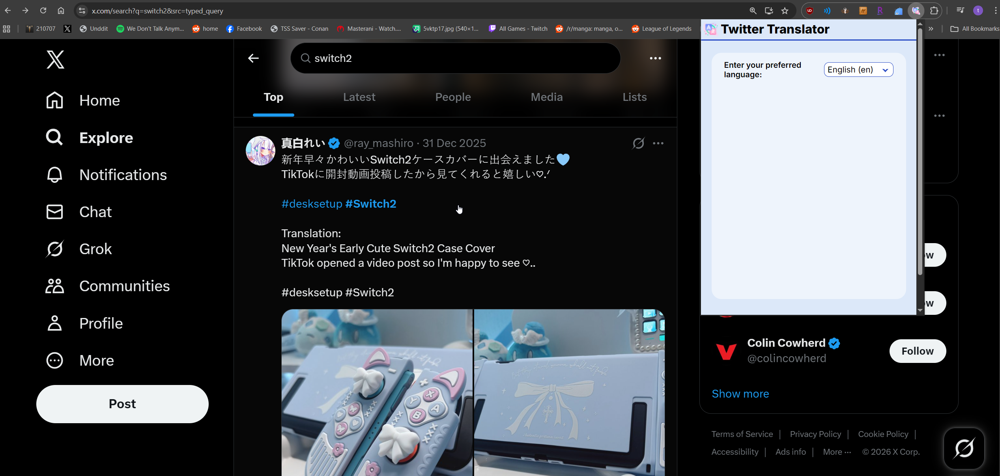

# Twitter Translator Extension
Twitter Translator is a simple chrome extension that automatically translates tweets into your target language as you scroll. The current implementation requires a self-hosted LibreTranslate API to function.

## Installation
1. Install LibreTranslate on your own machine. Follow the instructions on this [page](https://docs.libretranslate.com/).

2. Clone the repository.

2. Open Google Chrome and open the Extensions options by entering chrome://extensions in the address bar.

3. Enable Developer mode at the top right of your screen.

4. Click the "Load unpacked" button at the top left and then select the directory that you cloned earlier.

## Usage
1. Run LibreTranslate. 

2. Click on the Twitter Translator icon in your chrome toolbar.

3. Select what target language you want all tweets to be on. This should refresh all tabs that are on twitter.

You are now ready to use the extension.

## License
Twitter Translator is released under the MIT License.

